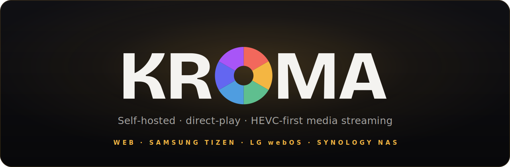

<div align="center">



<br/>

**Your own Netflix — everything built in, on hardware you own.**
Find it, download it, organize it, stream it. One blazing-fast Rust binary:
indexers · torrent engine · VPN + kill switch · AI · player · web & TV clients.
No Sonarr, no Radarr, no Jackett, no qBittorrent, no Gluetun — **just KROMA.**

[](LICENSE)
[](https://bun.sh)
[](https://www.rust-lang.org)
[](https://www.typescriptlang.org)
[](#platforms)
[](CONTRIBUTING.md)

</div>

---

KROMA is a self-hosted, multi-platform **media stack that does the whole job** —
the *arr suite, your indexer aggregator, your torrent client, your VPN wrapper
and your media server, collapsed into **one Rust binary**. Request a title and
KROMA searches your trackers, scores the releases, grabs the best one through its
built-in torrent engine (tunneled through your VPN, behind a kill switch),
imports and renames it Plex-style, enriches it from **TMDB**, and direct-play
streams it to the web, your phone and your living-room TV — wrapped in one calm,
cinematic, amber-on-charcoal design language.

**No moving parts to wire together.** Where a typical setup bolts together
Sonarr + Radarr + Prowlarr/Jackett + qBittorrent + Gluetun + Jellyfin + Overseerr
(six containers, six configs, six things that break), KROMA is a single process
that starts in milliseconds, sips RAM, and has no transcode farm to keep warm —
because Rust is fast and the video is never re-encoded.

### Everything built in

| | | |
| --- | --- | --- |
| 🔎 **Indexers** | native Cardigann engine (runs Jackett/Prowlarr tracker definitions directly) **+** Torznab | no aggregator to run |
| ⬇️ **Downloader** | embedded BitTorrent engine (librqbit, in-process) **+** Transmission / qBittorrent | no separate client |
| 🧠 **Acquisition** | requests, automatic wanted-list, a quality decision-engine that scores + picks releases | no Sonarr/Radarr |
| 🔒 **VPN + kill switch** | managed WireGuard→SOCKS5 bridge; downloads pause the instant the tunnel drops | no Gluetun |
| ▶️ **Player** | direct-play, HEVC-first — original files range-streamed, decoded natively | no transcode farm |
| 📺 **Clients** | web, mobile-responsive web, Samsung, LG, Android TV, desktop | one codebase |
| ✨ **AI** | on-device recommendations + semantic search, Whisper subtitle generation, optional LLM | no cloud |
| 👥 **Multi-user** | accounts, profiles, PIN locks, passkeys, invites, per-user permissions | share safely |
| 📊 **Statistics** | live download/library/watch dashboards over a real-time WebSocket bus | at a glance |

All of it self-hosted, private, and offline-capable: your library and your
activity never leave your network.

> **Playback is direct-play, HEVC-first.** The server never transcodes video: it
> **range-streams the original files** and every client decodes HEVC/H.265 (incl.
> 10-bit / HDR) natively Samsung & LG TVs in hardware, modern browsers where
> supported so your NAS CPU stays idle. The one exception is an **audio-only**
> HLS path for browsers that can't decode AC3/EAC3/DTS (video is copied, only the
> audio is re-encoded to stereo AAC).

<div align="center">

<table>
  <tr>
    <td width="50%" valign="top">
      <br/>
      <sub><b>Web home</b> · full-bleed hero + horizontal rails</sub>
    </td>
    <td width="50%" valign="top">
      <br/>
      <sub><b>TV detail</b> · 10-foot, remote-driven spatial focus</sub>
    </td>
  </tr>
  <tr>
    <td width="50%" valign="top">
      <br/>
      <sub><b>Films</b> · library grid</sub>
    </td>
    <td width="50%" valign="top">
      <br/>
      <sub><b>Spotlight</b> · instant search</sub>
    </td>
  </tr>
  <tr>
    <td width="50%" valign="top">
      <br/>
      <sub><b>Mobile</b> · responsive design (client in progress)</sub>
    </td>
    <td width="50%" valign="top">
      <br/>
      <sub><b>Requests</b> · ask for a title</sub>
    </td>
  </tr>
</table>

</div>

## Features

- **Blazing fast, single binary** the whole stack is one Rust process (axum +
  SQLite, embedded torrent engine, in-process ML) — boots in milliseconds, idles
  near-zero CPU, no JVM, no container orchestra, no transcode farm to keep warm.
- **Built-in indexer engine** a native reimplementation of **Cardigann** runs the
  same community-maintained tracker definitions Jackett/Prowlarr use — fetched at
  runtime, HTML/JSON/XML scraping, logins, Cloudflare (FlareSolverr) — so you
  search real trackers with **no aggregator to install**. Torznab endpoints still
  work side by side.
- **Built-in torrent engine** an embedded BitTorrent client (librqbit, in-process)
  grabs releases directly; Transmission / qBittorrent are supported too. Disable
  it and active downloads pause on the spot.
- **Automatic acquisition** request a movie or show and KROMA searches every
  indexer, **scores each release** against a quality profile (resolution, codec,
  size, seeders, keywords), grabs the best, then imports + renames it into the
  library. Manual search + one-click grab (with override) for the picky.
- **VPN with a real kill switch** paste a WireGuard config and KROMA runs a managed
  WireGuard→SOCKS5 bridge; all torrent traffic is tunneled, and a failed tunnel
  check **pauses every download instantly** — no leaks, no Gluetun sidecar.
- **On-device AI** recommendations and semantic "themed" rows from local content
  embeddings + watch history, typo-tolerant full-text search, and **Whisper**
  subtitle generation — all on your box, no cloud, no per-user training.
- **Multi-user & private** accounts, profiles, PIN-locked profiles, WebAuthn
  passkeys, invite links, per-user permissions, resume-anywhere and Quick Connect
  QR pairing for TVs.
- **Live everything** a WebSocket bus streams scan/enrich/library and
  download progress + speed/ETA to admin dashboards and clients in real time.
- **Direct-play, HEVC-first** original files are range-streamed; clients decode
  HEVC/H.265, AV1, H.264 themselves. No transcode pipeline, no hot NAS.
- **Plex-style library scan** detects movies vs. TV shows, parses `S01E02` /
  `1x02` / multi-episode markers, strips release junk from titles, groups shows →
  seasons → episodes. Hardened against 4000+ real-world filenames.
- **TMDB metadata + artwork** overviews, posters, backdrops, genres, ratings,
  keywords, IMDb IDs; cached to disk as WebP. Works out of the box with a built-in key.
- **Smart, automatic home** the server assembles the home screen: For You,
  "because you watched…", themed/seasonal rows, trending and recently-added built
  from on-device content embeddings + watch history. No cloud, no per-user
  training; an optional multilingual semantic model upgrades the themed rows.
- **Typo-tolerant search** full-text catalogue search over titles, cast and
  genres, tuned for imperfect input (incl. TV voice queries).
- **One design language, three shells** web (desktop), Samsung Tizen and LG
  webOS TVs share `@kroma/core`, `@kroma/ui` and the entire `@kroma/tv` experience.
- **10-foot TV UX** spatial remote navigation, lazy poster decoding,
  `content-visibility`, memoized tiles, a single-chunk ~52 kB build. Feels like
  Netflix / Disney+.
- **Real-time sync** a WebSocket event bus pushes scan/enrich/library updates;
  posters appear live as TMDB resolves, no client relaunch.
- **Zero-config discovery** the server advertises over mDNS and clients
  subnet-scan the LAN, so TVs find it with no manual IP entry.
- **Resume, profiles & Quick Connect** picks up where you left off; TV pairs to
  an account by scanning a QR code.
- **Self-hosted & private** a single Rust binary (or Docker image) on your NAS.
  Your library never leaves your network.

## Architecture

The web, Tizen and webOS clients are **thin shells**: all UI lives in `@kroma/ui`,
all logic in `@kroma/core`, and the entire TV experience in `@kroma/tv`. HEVC
detection and the API contract are written once.

```
kroma/
├─ server/                 Rust media server (axum) Plex-style scan, SQLite, range streaming
├─ packages/
│  ├─ core/   @kroma/core    API client · types · HEVC capability detection · remote map · direct-play
│  ├─ ui/     @kroma/ui      design-system React components + tokens (from design/)
│  └─ tv/     @kroma/tv      shared 10-foot experience (spatial focus nav, home, detail, player)
├─ clients/
│  ├─ web/    @kroma/web     desktop browser shell (sidebar) TanStack Start SSR + Tailwind v4
│  ├─ tizen/  @kroma/tizen   Samsung TV thin shell + config.xml → .wgt
│  ├─ webos/  @kroma/webos   LG TV thin shell (modern + legacy tiers) → .ipk
│  ├─ androidtv/ @kroma/androidtv  Android TV WebView shell + native ExoPlayer → .apk
│  ├─ mobile/ @kroma/mobile   iPhone / iPad / Android app (Expo + expo-video) → .ipa/.apk
│  └─ tv-build/              shared TV-shell build pipeline (tv.target.ts per shell)
└─ design/                  imported design source (tokens, components, guidelines, KROMA.dc.html)
```

| Package / app | What it is | README |
| ------------- | ---------- | ------ |
| `server` | Rust media server scan, SQLite, TMDB, range/HLS streaming | [server/README.md](server/README.md) |
| `@kroma/core` | API client, types, HEVC detection, remote map, direct-play | [packages/core/README.md](packages/core/README.md) |
| `@kroma/ui` | Design-system React components + tokens | [packages/ui/README.md](packages/ui/README.md) |
| `@kroma/tv` | Shared 10-foot TV experience | [packages/tv/README.md](packages/tv/README.md) |
| `@kroma/web` | Desktop browser client | [clients/web/README.md](clients/web/README.md) |
| `@kroma/tizen` | Samsung TV (Tizen) shell | [clients/tizen/README.md](clients/tizen/README.md) |
| `@kroma/webos` | LG TV (webOS) shell, modern + legacy (2018+) tiers | [clients/webos/README.md](clients/webos/README.md) |
| `@kroma/androidtv` | Android TV / Google TV shell (WebView + ExoPlayer) | [clients/androidtv/README.md](clients/androidtv/README.md) |
| `@kroma/mobile` | iPhone / iPad / Android app (Expo, offline downloads) | [clients/mobile/README.md](clients/mobile/README.md) |
| `design` | Design system source (tokens, guidelines) | [design/readme.md](design/readme.md) |

## Prerequisites

- **[Bun](https://bun.sh)** ≥ 1.3 package manager + runner (the repo is a Bun workspace)
- **[Rust](https://www.rust-lang.org)** ≥ 1.86 + **ffmpeg/ffprobe** for the server's metadata + HLS path
- Optional, only to package TV apps: **Tizen Studio** (Samsung) · **webOS TV CLI**
  [`@webos-tools/cli`](https://www.npmjs.com/package/@webos-tools/cli) (LG)

## Quickstart

```bash
bun install
bun run dev      # ONE command: media server (:4040) + web client (:3000) together
```

Open <http://localhost:3000>. In dev, Vite reverse-proxies `/api` to the Rust
server on :4040, so the whole app is one origin. With no media configured, the server seeds demo
titles (movies + two shows, a HEVC/HDR 4K hero among them) so the UI is populated
immediately. Point it at real media with:

```bash
KROMA_MEDIA_DIRS=/volume1/media bun run server
```

```bash
bun start        # also builds (prepares) the Tizen app first, then runs dev
```

Prefer separate terminals? `bun run server`, then `bun run dev:web`.

## Platforms

Each TV client runs in a normal desktop browser for development **arrow keys +
Enter act as the remote**:

```bash
bun run dev:tizen      # :5174   Samsung
bun run dev:webos      # :5175   LG
bun run dev:androidtv  # :5176   Android TV
```

| Platform | Dev | Package & install |
| -------- | --- | ----------------- |
| **Web** (desktop browser) | `bun run dev:web` | `bun run build:web` → static/SSR bundle ([web README](clients/web/README.md)) |
| **Samsung TV** (Tizen) | `bun run dev:tizen` | `make -C clients/tizen deploy TV_IP=…` → `.wgt` ([tizen README](clients/tizen/README.md) · [SETUP](clients/tizen/SETUP.md)) |
| **LG TV** (webOS) | `bun run dev:webos` | `ares-package clients/webos/dist` → `.ipk` ([webos README](clients/webos/README.md)) |
| **Android TV / Google TV** | `bun run dev:androidtv` | `bun run build:androidtv` then `./gradlew assembleRelease` → `.apk` ([androidtv README](clients/androidtv/README.md)) |
| **iPhone / iPad / Android** | `bun run dev:mobile` | `bun run ios` / `bun run android` in `clients/mobile` (Expo prebuild + native build) ([mobile README](clients/mobile/README.md)) |

Every TV shell is driven by its `tv.target.ts` (platform, dev port, engine
floors) through the shared pipeline in
[`clients/tv-build/shell.ts`](clients/tv-build/shell.ts); webOS additionally
ships a **legacy tier** (ES2015 + flattened Tailwind v4 CSS, runtime-gated) for
Chromium 53-94 TVs (2018-2023). `bun run build:tv` builds all TV shells.

**Installing on real devices** (TV developer mode, macOS quarantine, sideloading):
see [INSTALL.md](INSTALL.md).

**Joining the beta as a tester** (TestFlight, Firebase, sideloading on a beamer),
written for non-technical users: see [BETA.md](BETA.md).

## Build

```bash
bun run build          # all frontends + typecheck every package
bun run typecheck      # typecheck only
bun run server:build   # cargo release build

bun run build:tizen && cd clients/tizen && tizen package -t wgt -s <profile> -- dist
bun run build:webos && ares-package clients/webos/dist
```

See each client's README for full device install steps.

## Server API

`http://<host>:4040/api`:

- **Catalogue** `GET /health`, `/libraries`, `/movies`, `/shows`, `/shows/:id`
  (seasons + episodes), `/items`, `/items/:id`, `/items/:id/metadata` (TMDB), posters.
- **Streaming** `/items/:id/stream` (HTTP range), `/items/:id/hls/…` (audio-only HLS).
- **Discovery** `/search?q=` (typo-tolerant full-text), `/home` (generated
  sections), `/for-you`, `/items/:id/similar`, `/themed?q=`, `/continue`.
- **Accounts & control** `/auth/*` (incl. Quick Connect), `/progress`,
  `/admin/*`, `GET /events` (WebSocket), `POST /scan`.

Configure via `KROMA_HOST` / `KROMA_PORT` / `KROMA_MEDIA_DIRS` / `KROMA_DATA_DIR` /
`KROMA_TMDB_API_KEY`. Library persisted in SQLite (`<data>/kroma.db`, WAL). Optional
semantic recommendations are a `--features semantic-embeddings` build (a BERT
sentence model in `KROMA_EMBED_MODEL_DIR`). **Full reference → [server/README.md](server/README.md).**

## Deploy on a Synology NAS, Docker host or Raspberry Pi

Synology: install the `.spk` from the package source (see
[INSTALL.md](INSTALL.md)). Everything else runs the **multi-arch** Docker image
(`linux/amd64` + `linux/arm64`, so a Raspberry Pi 4/5 on a 64-bit OS works):

```bash
docker run -d -p 4040:4040 \
  -e KROMA_MEDIA_DIRS=/media \
  -v /volume1/video:/media \
  -v kroma-data:/data \
  ghcr.io/maxscharwath/kroma:latest
```

Mount media read-write if you use the built-in requests/downloads (imports
write into the library); `/data` holds the DB, caches and download staging.
Volume details + from-source builds: [server/README.md](server/README.md).
Then point each TV/web client at `http://<host>:4040` on first launch (or let
auto-discovery find it).

## Design system

`design/` is the imported design source deep-charcoal + amber, Bricolage
Grotesque / Hanken Grotesk, French copy, no emoji. Its tokens and components are
ported into `@kroma/ui`; `design/KROMA.dc.html` is the full clickable reference.

```bash
open design/KROMA.dc.html
```

More in [design/readme.md](design/readme.md).

## Contributing

Issues and PRs are welcome see [CONTRIBUTING.md](CONTRIBUTING.md) for setup,
conventions (keep clients thin), and how to report playback bugs.

## License

[MIT](LICENSE) © 2026 [Maxime Scharwath](https://github.com/maxscharwath)
